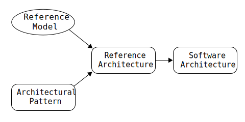

# Chapter 2: What Is Software Architecture?

	<h4>Definition</h4>
	
The software architecture of a program or computing system is the structure or structures of the system, which comprise software elements, the externally visible properties of those elements, and the relationships among them.

Externally visible properties are the assumptions other elements can make of an element. These properties include services the element provides, performance characteristics, fault handling and resources shared. 

The architecture comprises the information of how elements relate to one another. The architecture does not delve into the inner workings of these elements. 

Systems can and do comprise of more than one structure; some structures are more focussed on how they interact to facilitate the system's functions. 

Every computing system with software has a software architecture because it comprises elements and their relationships.

The observable behaviour of elements is also a part of the architecture.

## Other Points of View

Software architecture is:

* Not just "high-level" design. Other tasks associated with design are independent of the architecture. The architecture will _influence_ the design.
* Not the "overall structure" of the system. Architecture is composed of many structures that will provide engineering leverage points.
* Not the underpinning of the software process. The system architecture can be discovered and analysed independently of the process by which the architecture was evolved.
* Not a matter of components and connectors. "Connectors" imply run-time characteristics of the system. This make non run-time aspects of the architecture less important.

## Architectural Patterns, Reference Models, and Reference Architectures

1. _An architectural pattern is a description of element and relation types together with a set of constraintson how they may be used._ "Client-server" is a common architectural pattern. Patterns exhibit known quality attributes.
2. _A reference model is a division of functionality together with data flow between the pieces._ A reference model is a standard decomposition of a known problem into cooperative parts that form the solution.
3. _A reference architecture is a reference model mapped onto software elements (that cooperatively implement the functionality defined in the reference model) and the data flows between them._ A reference architecture maps functionality onto a system decomposition.

## Why Is Software Architecture Important?

* It is the vehicle for stakeholder communication.
* It manifests the earliest design decisions.
	- The architecture defines constraints on implementation
	- The architecture dictates organizational structure
	- The architecture inhibits or enables a system's quality attributes
	- By studying the architecture, you can predict system qualities.
	- The architecture makes it easier to reason about or manage change.
	- The architecture helps in evolutionary prototyping.
	- The architecture enables more accurate cost and schedule estimates.
* It is a transferable, re-usable model
	- Software product lines share a common architecture.
	- Systems can be built using large, externally developed elements.
	- Less is more: it pays to restrict the vocabulary of design alternatives.
	- An architecture permits template-based development.
	- An architecture can be the basis for training.

## Architectural Structures and Views

A view is a representation of a coherent set of architectural elements suited to the particular stakeholder(s). A structure is the set of elements themselves, either as software or hardware.
