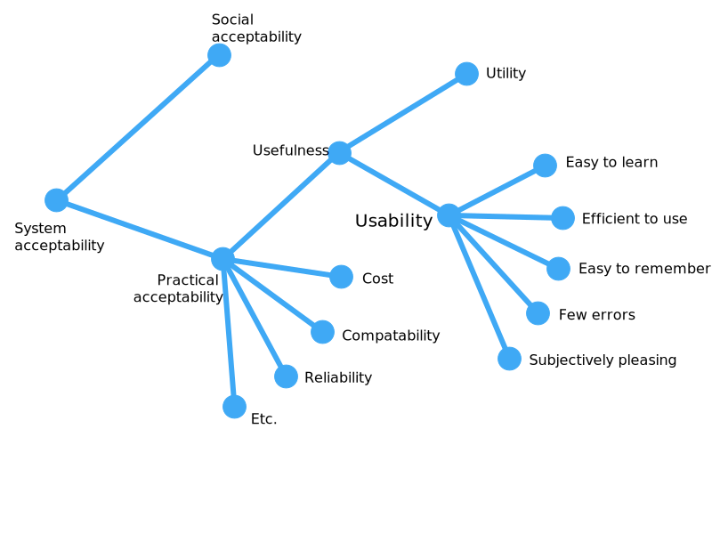

# Chapter 2 - What is Usability

Usability is not "user friendliness": users don't need machines to be friendly to them, they just need machines that will not stand in their way when they try to get their work done.

User needs cannot be described along a single dimension; what one user perceives as friendly may feel very tedious to another.

## Usability and Other Considerations

Usability is a narrow concern compared to the larger issue of system acceptability - the question of whether the system is good enough to satisfy all the needs and requirements of the users and other potential stakeholders. The overall acceptability of the system is a combination of its social acceptability and its practical acceptability.

_A model of the attributes of system acceptability:_

Usability applies to all aspects of a system with which a human might interact, including installation and maintenance procedures.

## Definition of Usability

Traditionally usability is associated with these attributes:

* _Learnability_: Easy to learn so the user can rapidly and effectively work with the system.
* _Efficiency_: Once the user has learned the system, a high level of productivity is achievable.
* _Memorability_: The casual user who returns to the system after some period of not using it does not have to learn everything from scratch.
* _Errors_: A low error rate so that users make few errors interacting with the system, and if users do make errors, they can easily recover from them. Catastrophic errors must not occur.
* _Satisfaction_: The user should find the system pleasant to use.

Clarifying the measurable aspects of usability is much better than aiming at a warm, fuzzy feeling of "user friendliness".

Usability is measured relative to certain users and certain tasks.

A system's overal usability can be determined as a set of measures, usually taken from the attributes given above. The mean of the measurements of each attribute are checked if they are better than a previously specified minimum.

